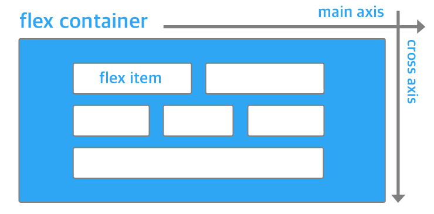
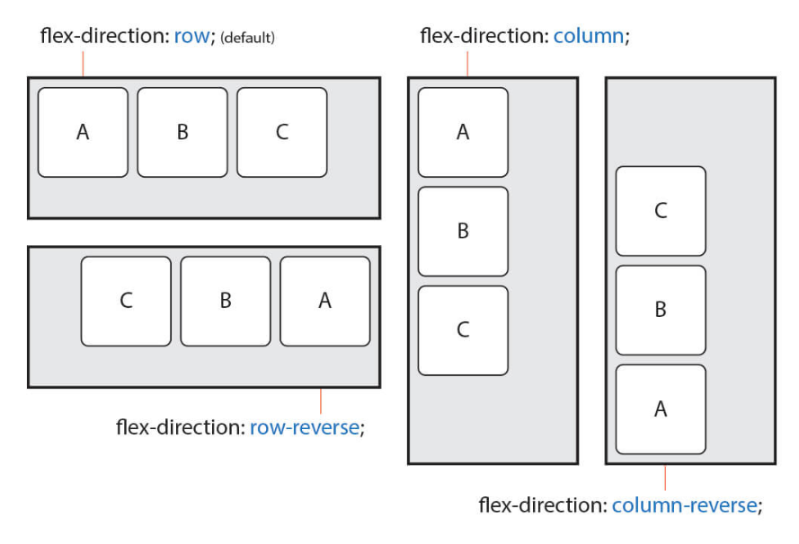

웹페이지의 레이아웃 표현: ```display,float,position```
- flex
쉬운 수직 구성 가능

정렬하려는 요소의 부모 요소에 ```display:flex```속성 선언
- 전체적인 정렬이나 흐름에 관련된 속성은 flex container에 정의, 자식 요소의 크기나 순서에 관련된 속성은 flex item에 정의
  - flex container 속성: flex-direction, flex-wrap, justify-content, align-items, align-content
  - flex item 속성: flex, flex-grow, flex-shrink, flex-basis, order
```
flex-direction: 주축;
```
