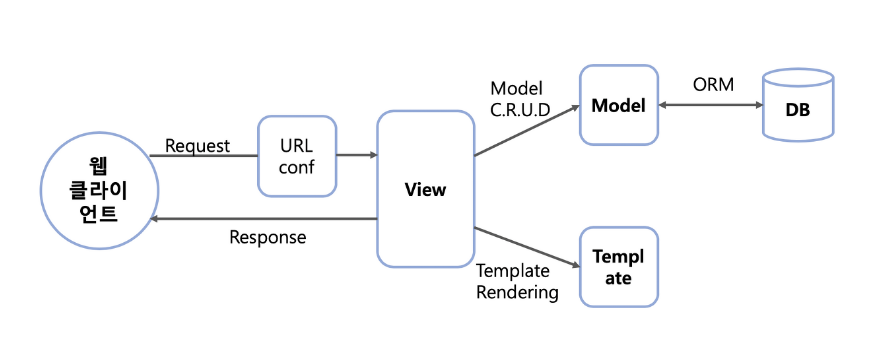

### 사이클
url -> view -> template 순서대로! 데이터 흐름대로 짜기
- 앱생성
```
python manage.py startapp articles
```

- 앱 생성 후 등록하기
settings.py
```
INSTALLED_APPS = [
  'articles',

]
```


- view.py (앱)
```
def index(request): #요청객체 request
  return 응답(메인 페이지)
```
특정 기능 수행하는 view 함수 만듦.
request객체 보냄.
- urls.py(프로젝트)
urls.py 입장에서는 articles라는 패키지에서 views라는 모듈을 가져와야함
```
from articles import views
```
- 앱 폴더 안에 templates 폴더 만들기!
index.html 만들고
views.py 에서 응답객체 만들기.
```
def index(request):
  return render(request, 'index.html')
```
urls.py
```
urlPatterns = [
  path('articles/',views.index) #뒤 인자는 콜백함수
]
```
https://127.0.0.1:8000/articles/로 요청이 왔을때 views 모듈의 index 뷰 함수를 호출함!


### url 분리
- 앱 안에 urls.py
```
from django.urls import path
from . import views

app_name = 'accounts'
urlpatterns = [
    
]
```
프로젝트의 urls.py
```
urlpatterns = [
    path('admin/', admin.site.urls),
    path('articles2/',include('articles2.urls')),
    path('todos/',include('todos.urls')),
    path('accounts/',include('accounts.urls')),
]
```