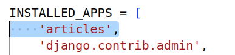

# Model Class 생성

- 프로젝트 및 앱 생성
```
django-admin startproject crud
python manage.py startapp articles #articles 앱 만듦
```
- setting.py에 articles 앱 등록  

- 모델 생성 (models.py)
```
class Article(models.Model):
  title = models.CharField(max_length=10)
  content = models.CharField(max_length=80)
```
### migrations
```
python manage.py makemigrations
```
하면 초안설계도 생성됨 (0001_initial.py)
아직 db.sqlite3 데이터베이스에 설계도 안보내짐.
```
python manage.py migrate
```
