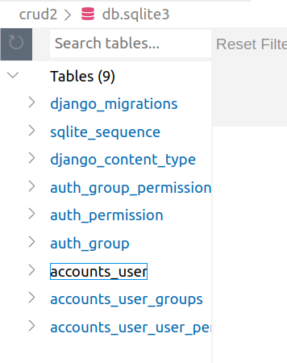

# Custom User Model
기존의 유저모델을 커스텀
프로젝트 처음에 해주기
- 1단계. 대체
앱의 models.py
```
from django.db import models
from django.contrib.auth.models import AbstractUser

class User(AbstractUser):
  pass
```
프로젝트의 settings.py
```
AUTH_USER_MODEL = 'accounts.User'
```
앱의 admin.py
```
from django.contrib import admin

from django.contrib.auth.admin import UserAdmin
from .models import User

admin.site.register(User,UserAdmin)
```
```
python manage.py makemigrations
python manage.py migrate
```
