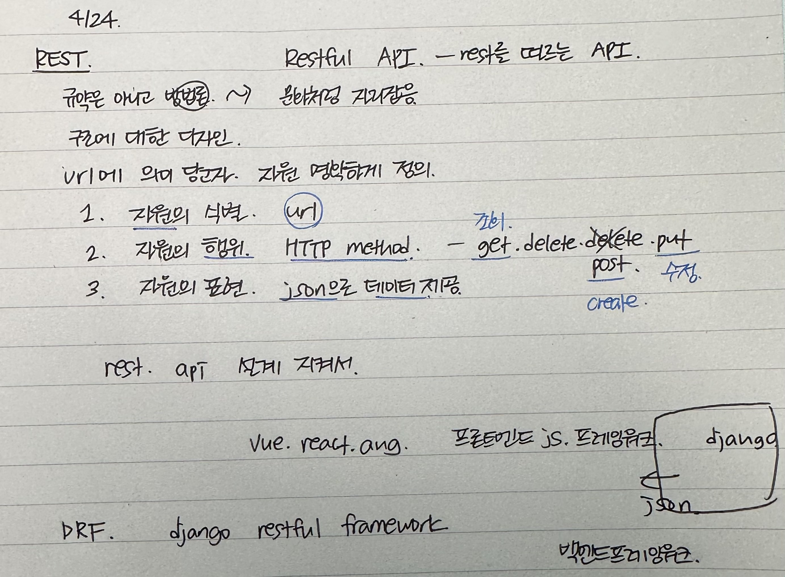
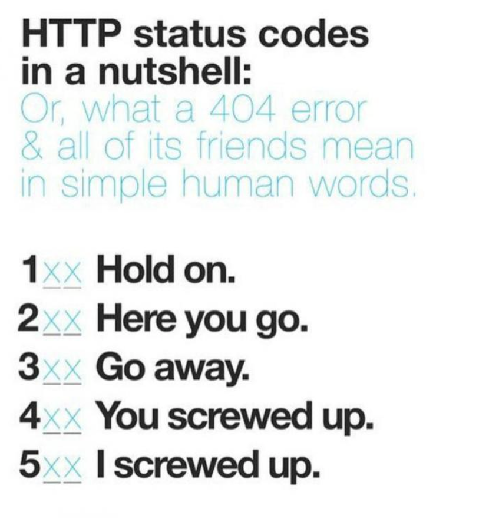
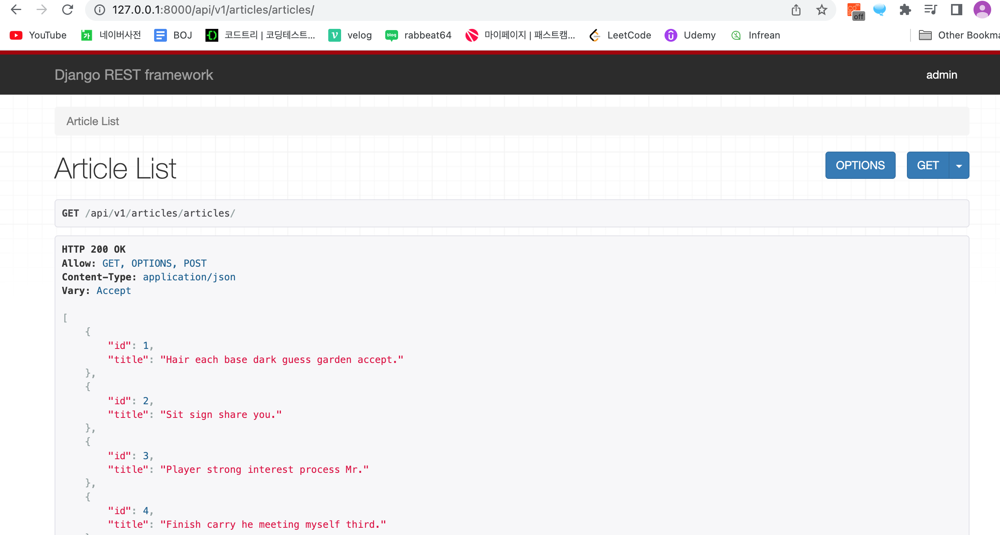

# RESTful API
💡 RESTful API란 HTTP 통신을 Rest설계 규칙을 잘 지켜서 개발한 API
Rest 설계 규칙은 URI는 자원만 표현해야 하며, 자원의 상태와 행위는 HTTP Method에 명시하는걸 말함

## [DRF](https://www.django-rest-framework.org/)



### serializer
serializers.py
```
from rest_framework import serializers
from .models import Article


class ArticleListSerializer(serializers.ModelSerializer):
    class Meta:
        model = Article
        fields = ('id','title','content',)

class ArticleSerializer(serializers.ModelSerializer):
    class Meta:
        model = Article
        fields = '  __all__'
```
# 데이터 생성 POST
# 데이터 조회 GET

##### 지난시간
- 모델 정의
```
from django.db import models
class Article(models.Model):
    title = models.CharField(max_length=10)
    content = models.TextField()
    created_at = models.DateTimeField(auto_now_add=True)
    updated_at = models.DateTimeField(auto_now=True)
```
```
python manage.py makemigrations
python manage.py migrate
```
- fixtures
앱폴더/fixtures/articles.json
```
python manage.py loaddata articles.json
```
- db.sqllite3 안보일때
우클릭 -> Open Database -> Show table